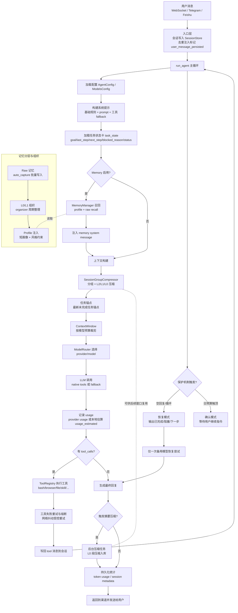

# WhaleClaw Agent 整改报告

## 1. 本次改动概览

- 改动目标：在保持省 token 的前提下，提升复杂任务连续性、降低空回复/死循环、避免身份跑偏。
- 改动范围：`agent`、`sessions`、`providers`、`memory`、配置与运行规范文档。
- 结果：全量测试通过（`340 passed`，使用 `conda run -n whaleclaw python -m pytest`）。

---

## 2. 已完成的关键改动

### 2.1 修复用户消息重复注入

- 问题：入口已持久化用户消息，`run_agent` 内又重复 append，导致上下文噪声和 token 浪费。
- 方案：统一为“入口持久化 + run_agent 防重追加”。
- 主要文件：
  - `whaleclaw/agent/loop.py`
  - `whaleclaw/gateway/ws.py`
  - `whaleclaw/channels/telegram/bot.py`
  - `whaleclaw/channels/feishu/bot.py`

### 2.2 增加任务状态卡（持久化）

- 新增 `task_state` 结构：
  - `goal`
  - `last_step`
  - `next_step`
  - `blocked_reason`
  - `status`
- 每轮 LLM 调用前注入短状态块，保证长任务中间状态不丢。
- 主要文件：
  - `whaleclaw/sessions/manager.py`
  - `whaleclaw/agent/loop.py`

### 2.3 空回复与循环恢复模式

- 连续空回复触发恢复模式，输出结构化进度（目标/已完成/阻塞/下一步）。
- 重复工具调用循环更早识别，触发恢复路径。
- 恢复时仅尝试一次备用模型，避免反复重试烧 token。
- 主要文件：
  - `whaleclaw/agent/loop.py`

### 2.4 工具策略增强（任务阶段感知）

- 对安装/技能/仓库类任务，强制保留 `skill + bash + browser`，避免关键工具被 top-k 挤掉。
- 网络类失败（browser/bash）增加受控重试，提升抖动场景成功率。
- 主要文件：
  - `whaleclaw/agent/loop.py`

### 2.5 预算治理（省 token 对齐）

- 新增预算参数：
  - `max_llm_calls_per_day`
  - `max_tokens_per_day`
  - `max_retries_per_task`
  - `auto_split_after_rounds`
- 达到预算阈值进入确认模式。
- 高轮次自动提示拆解为“检索/执行/验证”三段。
- 主要文件：
  - `whaleclaw/config/schema.py`
  - `whaleclaw/sessions/store.py`
  - `whaleclaw/agent/loop.py`

### 2.6 Provider usage 统计修复

- OpenAI 兼容流式增加 `stream_options.include_usage=true`。
- usage 缺失时做本地估算并标记 `usage_estimated=true`。
- 主要文件：
  - `whaleclaw/providers/openai_compat.py`
  - `whaleclaw/providers/base.py`

### 2.7 上下文压缩策略升级

- 移除“第一轮永久锚点”。
- 改为“最新未完成任务锚点”，减少历史污染和身份漂移。
- 主要文件：
  - `whaleclaw/sessions/group_compressor.py`

### 2.8 Memory 兼容性修复（确保测试稳定）

- Hybrid 检索阈值调整，改善语义召回稳定性。
- auto_capture 的 flush 条件细化，兼顾“及时落库”和“批量缓冲”语义。
- 主要文件：
  - `whaleclaw/memory/vector.py`
  - `whaleclaw/memory/manager.py`

### 2.9 Python 运行规范统一为 conda 环境

- 全项目规范统一为 `whaleclaw` conda env。
- 文档、规则、prompt、依赖安装逻辑全部同步。
- 主要文件：
  - `AGENTS.md`
  - `.cursor/rules/python-runtime.mdc`
  - `docs/specs/phase1-foundation.md`
  - `whaleclaw/agent/prompt.py`
  - `whaleclaw/tools/deps.py`

---

## 3. 当前系统工作原理（简化版）

### 3.1 消息入口

- WebSocket/Telegram/Feishu 接收消息后先入会话，再调用 `run_agent`。
- 通过 `user_message_persisted` 防止同轮用户消息重复注入。

### 3.2 Agent 主循环

- 组装系统提示（基础规则 + 记忆 + 任务状态卡）。
- 构建上下文窗口（含压缩与摘要）。
- 调用模型，解析工具调用，执行工具并回填结果。
- 直到产出最终文本或触发保护机制（预算/空回复/循环）。

### 3.3 任务连续性机制

- `task_state` 跨轮持久化在 session metadata。
- 每轮注入短状态卡，确保模型始终“知道当前做到了哪一步”。

### 3.4 失败恢复机制

- 空回复、循环、工具连续失败会进入恢复模式。
- 恢复模式输出结构化进度，并限制备用模型切换次数。

### 3.5 压缩与记忆

- 上下文按组压缩（L2/L1/L0）并保留任务相关关键内容。
- Memory 支持自动捕获、召回、画像组织，注入系统层辅助长期一致性。

### 3.6 token 可观测性与预算

- 记录每轮 token 使用，usage 缺失时可估算并打标。
- 支持日级调用数/token 上限，超限后转确认模式。

---

## 4. 关键可调参数

以下参数位于 `whaleclaw/config/schema.py`：

### 4.1 Agent 预算与稳定性

- `max_tool_rounds`：单任务最大轮次。
- `max_llm_calls_per_day`：每日 LLM 调用上限。
- `max_tokens_per_day`：每日 token 上限。
- `max_retries_per_task`：单任务重试上限。
- `auto_split_after_rounds`：达到该轮次后自动拆任务提示。

### 4.2 Summarizer 压缩预算

- `enabled`：是否启用摘要/压缩。
- `content_budget`：压缩注入总预算。
- `recent_budget`：近历史预算。
- `history_budget`：远历史预算。

### 4.3 Memory 相关

- `enabled`：是否开启长期记忆。
- `recall_limit`：召回条数上限。
- `recall_profile_max_tokens`：画像注入预算。
- `recall_raw_max_tokens`：原始记忆注入预算。
- `cooldown_seconds`：自动捕获冷却。
- `max_per_hour`：每小时捕获上限。

---

## 5. 建议调优顺序

1. 先稳住：`max_retries_per_task=1~2`，避免重试风暴。
2. 再控成本：按日预算设置 `max_llm_calls_per_day` 与 `max_tokens_per_day`。
3. 再提效率：长任务将 `auto_split_after_rounds` 调到 `6~8`。
4. 最后细抠 token：优先降低 `recall_raw_max_tokens`，再调 `content_budget`。

---

## 6. 验证结果

- 运行环境：`miniconda` `whaleclaw` env。
- 验证命令：`conda run -n whaleclaw python -m pytest`
- 结果：`340 passed`

---

## 7. 项目整体工作原理流程图

